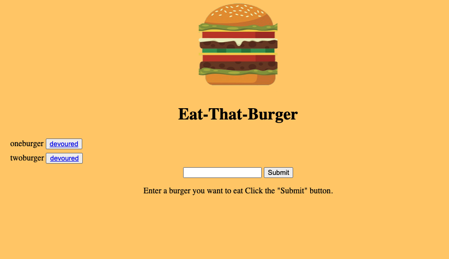

# E-Commerce-Back-End

## DESCRIPTION

Eat-Da-Burger! is a restaurant app that lets users input the names of burgers they'd like to eat. Whenever a user submits a burger's name, the app will display the burger on the left side of the page -- waiting to be devoured. Each burger in the waiting area also has a Devour it! button. When the user clicks it, the burger will move to the right side of the page. The app will store every burger in a database, whether devoured or not.

## LANGUAGE/TECHNOLOGIE

* MySQL

* Node.JS

* Express.JS

* Handlebars

### image

### heroku deployed link

[see me](https://e-commerce-back-ends.herokuapp.com/)

